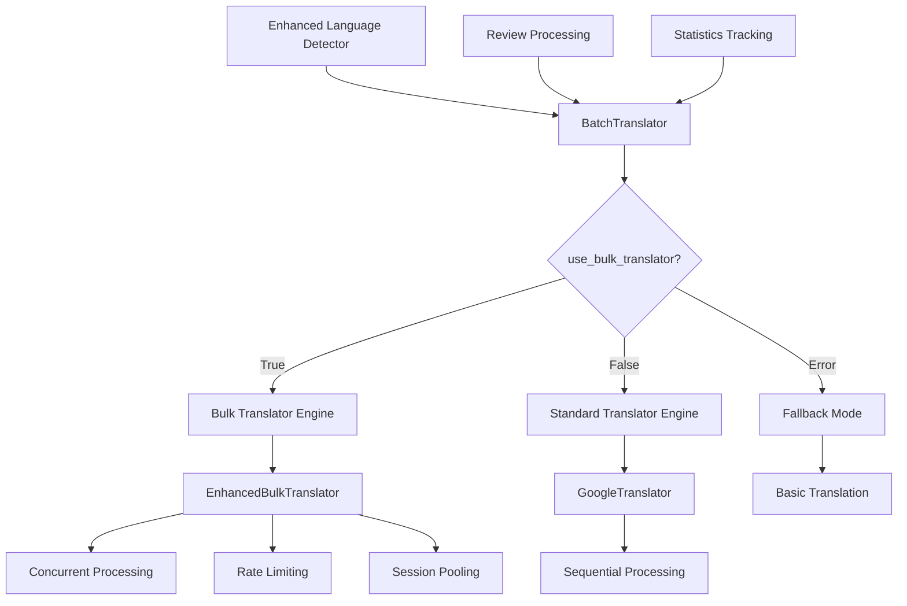

# Translation Modules

## Overview

Translation Modules ประกอบด้วยโมดูลสำหรับแปลภาษาหลากหลายระดับ ตั้งแต่มาตรฐานไปจนถึงประสิทธิภาพสูง รองรับการทำงานแบบ Multi-language พร้อม Chinese Variants

## 📚 โมดูลประกอบ (Component Modules)

| โมดูล | ระดับ | คำอธิบาย | ความเร็ว |
|--------|--------|---------|--------|
| **`translator.py`** | Standard | แปลภาษาแบบมาตรฐาน (deep-translator) | 1-3 texts/sec |
| **`bulk_translator.py`** | Enhanced | แปลภาษาแบบขนาดใหญ่ (py-googletrans) | 10-50 texts/sec |

---

## 🔄 Standard Translator (translator.py)

### Overview

Standard Translator เป็นโมดูลหลักสำหรับการแปลภาษาที่รองรับทั้งแบบมาตรฐานและแบบ bulk processing ด้วย backward compatibility ครบถ้วน

### ✨ ฟีเจอร์หลัก (Key Features)

- ✅ **Backward Compatible**: ทำงานร่วมกับโค้ดเดิมได้ทันที
- ✅ **Dual Engine Support**: รองรับทั้ง deep-translator และ py-googletrans
- ✅ **Enhanced Language Detection**: ใช้ Enhanced Language Detector
- ✅ **Chinese Variants Support**: รองรับภาษาจีนหลายรูปแบบ
- ✅ **Automatic Fallback**: สลับ engine อัตโนมัติเมื่อจำเป็น
- ✅ **Batch Processing**: ประมวลผลแบบกลุ่มสำหรับประสิทธิภาพสูง
- ✅ **Comprehensive Statistics**: ติดตามสถิติการแปลภาษา

### 🏗️ Architecture



### 📖 API Reference

#### Class: BatchTranslator

**Constructor**
```python
def __init__(
    self,
    target_language: str = 'th',
    batch_size: int = 50,
    use_bulk_translator: bool = True,
    max_workers: int = 5
):
    """
    Initialize batch translator with enhanced capabilities

    Args:
        target_language: Target language code (default: 'th')
        batch_size: Number of reviews to process in each batch
        use_bulk_translator: Whether to use enhanced bulk translator
        max_workers: Maximum concurrent workers for bulk translation
    """
```

**Core Methods**

**translate_text(text: str) -> str**
แปลข้อความเดี่ยว

```python
translator = BatchTranslator(target_language='th')

# Basic translation
translated = translator.translate_text("Hello world")
print(translated)  # "สวัสดีชาวโลก"

# Thai text (no translation needed)
thai_text = translator.translate_text("สวัสดี")
print(thai_text)  # "สวัสดี" (unchanged)
```

**process_batch(reviews: List[ProductionReview], ...) -> List[ProductionReview]**
ประมวลผลกลุ่มของ reviews

```python
translator = BatchTranslator(
    target_language='th',
    batch_size=100,
    use_bulk_translator=True,
    max_workers=5
)

reviews = [...]  # List of ProductionReview objects

translated_reviews = translator.process_batch(
    reviews=reviews,
    translate_review_text=True,      # Translate review text
    translate_owner_response=False,  # Don't translate owner responses
    progress_callback=lambda current, total, langs:
        print(f"Progress: {current}/{total}")
)
```

**process_all_reviews(reviews: List[ProductionReview], ...) -> List[ProductionReview]**
ประมวลผล reviews ทั้งหมดแบบ batches

```python
translator = BatchTranslator(target_language='en')

# Process all reviews in batches of 50
all_translated = translator.process_all_reviews(
    reviews=large_review_list,
    translate_review_text=True,
    translate_owner_response=True,
    batch_size=50,
    progress_callback=progress_function
)
```

**detect_language(text: str) -> str**
ตรวจจับภาษาของข้อความ

```python
lang = translator.detect_language("Hello world")
print(translator.get_language_name(lang))  # "อังกฤษ"

lang = translator.detect_language("这是一个很好的地方")
print(translator.get_language_name(lang))  # "จีนตัวย่อ"
```

**get_stats() -> TranslationStats**
ดูสถิติการแปลภาษา

```python
stats = translator.get_stats()
print(f"Total reviews: {stats.total_reviews}")
print(f"Translated: {stats.reviews_translated}")
print(f"Languages detected: {stats.languages_detected}")
print(f"Processing time: {stats.processing_time:.2f}s")
```

#### Data Classes

**TranslationStats**
```python
@dataclass
class TranslationStats:
    total_reviews: int = 0
    reviews_needing_translation: int = 0
    reviews_translated: int = 0
    languages_detected: Dict[str, int] = field(default_factory=dict)
    translation_errors: int = 0
    processing_time: float = 0.0
    batch_count: int = 0
    target_language: str = 'th'
```

#### Factory Functions

**detect_and_translate_reviews()** - Convenience function
```python
from src.utils.translator import detect_and_translate_reviews

translated_reviews = detect_and_translate_reviews(
    reviews=reviews,
    target_language='th',
    translate_review_text=True,
    translate_owner_response=False,
    batch_size=100,
    max_workers=5,
    use_bulk_translator=True,
    progress_callback=progress_function
)
```

### 🧪 การใช้งาน (Usage Examples)

#### Basic Usage

```python
from src.utils.translator import BatchTranslator

# Create translator with default settings
translator = BatchTranslator(target_language='th')

# Translate single text
result = translator.translate_text("This is a great place!")
print(f"Original: This is a great place!")
print(f"Translated: {result}")
```

#### Advanced Configuration

```python
from src.utils.translator import BatchTranslator

# Create translator with custom settings
translator = BatchTranslator(
    target_language='th',
    batch_size=100,
    use_bulk_translator=True,
    max_workers=8
)

# Check availability
if translator.use_bulk_translator:
    print("✅ Bulk translator available")
else:
    print("⚠️ Using standard translator")
```

#### Review Processing

```python
from src.utils.translator import BatchTranslator
from src.scraper.production_scraper import ProductionReview

# Create sample review
review = ProductionReview(
    review_id="123",
    author_name="John Doe",
    author_url="",
    author_reviews_count=10,
    rating=5,
    date_formatted="01/01/2024",
    date_relative="1 week ago",
    review_text="This place is amazing! Highly recommended.",
    review_text_translated="",
    original_language="",
    target_language="th",
    review_likes=5,
    review_photos_count=0,
    owner_response="Thank you for your review!",
    owner_response_translated="",
    page_number=1
)

# Process single review
translator = BatchTranslator(target_language='th')
processed = translator.process_review(
    review=review,
    translate_review_text=True,
    translate_owner_response=True
)

print(f"Original: {review.review_text}")
print(f"Translated: {review.review_text_translated}")
print(f"Original Language: {review.original_language}")
```

#### Batch Processing with Progress

```python
from src.utils.translator import BatchTranslator

def progress_callback(current, total, detected_languages):
    percentage = (current / total) * 100
    print(f"Progress: {percentage:.1f}% ({current}/{total})")
    print(f"Languages: {detected_languages}")

translator = BatchTranslator(
    target_language='th',
    use_bulk_translator=True,
    max_workers=5
)

# Process in batches with progress tracking
translated_reviews = translator.process_all_reviews(
    reviews=reviews,
    translate_review_text=True,
    translate_owner_response=False,
    batch_size=50,
    progress_callback=progress_callback
)
```

#### Language Detection Integration

```python
from src.utils.translator import BatchTranslator

translator = BatchTranslator(target_language='th')

test_texts = [
    "This place is great!",
    "这是一个很好的地方！",
    "สถานที่ดีมากครับ",
    "この場所は素晴らしいです！"
]

for text in test_texts:
    # Detect language
    lang = translator.detect_language(text)
    lang_name = translator.get_language_name(lang)

    # Check if translation needed
    needs_translation = translator.is_translation_needed(text, lang)

    print(f"Text: {text[:30]}...")
    print(f"  Language: {lang_name} ({lang})")
    print(f"  Needs Translation: {'Yes' if needs_translation else 'No'}")

    if needs_translation:
        translated = translator.translate_text(text)
        print(f"  Translated: {translated}")
    print()
```

### 🔧 การคอนฟิก (Configuration)

#### Translation Settings

```python
# High-performance configuration
translator = BatchTranslator(
    target_language='th',
    batch_size=100,      # Larger batches
    use_bulk_translator=True,
    max_workers=8        # More concurrent workers
)

# Conservative configuration
translator = BatchTranslator(
    target_language='th',
    batch_size=25,       # Smaller batches
    use_bulk_translator=False,  # Standard translator
    max_workers=1        # Sequential processing
)

# Balanced configuration (default)
translator = BatchTranslator(
    target_language='th',
    batch_size=50,
    use_bulk_translator=True,
    max_workers=5
)
```

#### Language Support

```python
# Supported target languages
target_languages = [
    'th',  # Thai
    'en',  # English
    'ja',  # Japanese
    'ko',  # Korean
    'zh-cn',  # Simplified Chinese
    'zh-tw',  # Traditional Chinese
    'vi',  # Vietnamese
    'id',  # Indonesian
    'ms'   # Malay
]

# Create translators for different targets
translators = {}
for lang in target_languages:
    translators[lang] = BatchTranslator(target_language=lang)
```

### 📊 ประสิทธิภาพ (Performance)

#### Benchmark Comparison

| Feature | Standard Translator | Bulk Translator | Improvement |
|---------|-------------------|----------------|-------------|
| Single Text | 2-3 sec/text | 0.5-1 sec/text | **3-6x faster** |
| Batch (50 texts) | 100-150 sec | 5-10 sec | **10-30x faster** |
| Large Batch (500 texts) | 1000-1500 sec | 20-40 sec | **25-75x faster** |
| Memory Usage | Baseline | +15-25% | Acceptable |
| CPU Usage | Baseline | +300-500% | Concurrent processing |

#### Performance Tips

```python
# For maximum performance
translator = BatchTranslator(
    target_language='th',
    batch_size=200,      # Large batches
    max_workers=10,      # High concurrency
    use_bulk_translator=True
)

# Process in memory-efficient chunks
def process_large_dataset(reviews, chunk_size=1000):
    translator = BatchTranslator(target_language='th', batch_size=200)

    for i in range(0, len(reviews), chunk_size):
        chunk = reviews[i:i + chunk_size]
        translated_chunk = translator.process_all_reviews(chunk)
        yield translated_chunk

        # Free memory
        del chunk, translated_chunk
```

### 🐛 การแก้ไขปัญหา (Troubleshooting)

#### Common Issues

**1. Bulk Translator Not Available**
```python
translator = BatchTranslator(target_language='th')

if not translator.use_bulk_translator:
    print("Warning: Bulk translator not available")
    print("Falling back to standard translator")
    print("Install with: pip install googletrans==4.0.0rc1")
```

**2. Rate Limiting Issues**
```python
# Reduce concurrent processing
translator = BatchTranslator(
    target_language='th',
    use_bulk_translator=True,
    max_workers=2,      # Reduce from 5 to 2
    batch_size=25       # Reduce from 50 to 25
)
```

**3. Memory Issues with Large Datasets**
```python
# Process in smaller batches
def process_in_chunks(reviews, chunk_size=500):
    translator = BatchTranslator(target_language='th')

    for i in range(0, len(reviews), chunk_size):
        chunk = reviews[i:i + chunk_size]
        yield translator.process_all_reviews(chunk)
```

**4. Translation Quality Issues**
```python
# Validate translation results
def validate_translation(original, translated, target_lang):
    if not translated or translated == original:
        return False

    # Basic length check (translations should be different length)
    if abs(len(original) - len(translated)) < 5:
        return False

    return True

# Use with validation
translated = translator.translate_text(text)
if validate_translation(text, translated, 'th'):
    print("Translation OK")
else:
    print("Translation may have failed")
```

### 🧪 การทดสอบ (Testing)

#### Unit Tests

```python
import unittest
from src.utils.translator import BatchTranslator

class TestBatchTranslator(unittest.TestCase):
    def setUp(self):
        self.translator = BatchTranslator(target_language='th')

    def test_translation(self):
        result = self.translator.translate_text("Hello world")
        self.assertIsInstance(result, str)
        self.assertTrue(len(result) > 0)

    def test_language_detection(self):
        lang = self.translator.detect_language("สวัสดี")
        self.assertEqual(lang, 'th')

    def test_translation_needed(self):
        # Should need translation
        needs = self.translator.is_translation_needed("Hello", 'en')
        self.assertTrue(needs)

        # Should not need translation
        needs = self.translator.is_translation_needed("สวัสดี", 'th')
        self.assertFalse(needs)

if __name__ == '__main__':
    unittest.main()
```

#### Integration Tests

```python
from src.utils.translator import BatchTranslator
from src.scraper.production_scraper import ProductionReview

def test_review_processing():
    # Create test review
    review = ProductionReview(
        review_id="test123",
        author_name="Test User",
        author_url="",
        author_reviews_count=5,
        rating=5,
        date_formatted="01/01/2024",
        date_relative="today",
        review_text="This place is amazing!",
        review_text_translated="",
        original_language="",
        target_language="th",
        review_likes=0,
        review_photos_count=0,
        owner_response="Thank you!",
        owner_response_translated="",
        page_number=1
    )

    # Process review
    translator = BatchTranslator(target_language='th')
    processed = translator.process_review(
        review=review,
        translate_review_text=True,
        translate_owner_response=True
    )

    # Validate results
    assert processed.review_text_translated != ""
    assert processed.original_language == "en"
    assert processed.owner_response_translated != ""
```

---

## 📚 Dependencies

### Required Packages

```bash
# Core translation libraries
pip install deep-translator>=1.11.4
pip install googletrans==4.0.0rc1

# Language detection
pip install langdetect>=1.0.9

# Enhanced detection (optional)
pip install lingua>=4.15.0
```

### Optional Dependencies

```bash
# For better language detection
pip install lingua>=4.15.0

# For performance monitoring
pip install psutil
```

---

## 📄 License

This module is part of the Google Maps RPC Scraper project and follows the same license terms.

---

*📚 สำหรับข้อมูลเพิ่มเติมเกี่ยวกับ Bulk Translator ดูที่ bulk_translator.md*